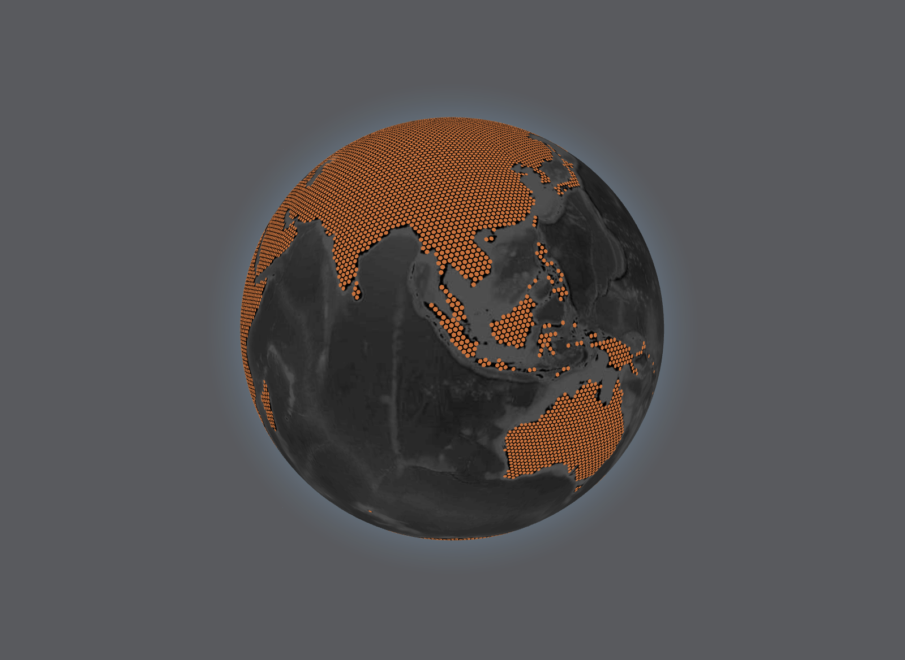

# Svelte + Threlte + Three.js + three.globe

Basic implementation of [three-globe](https://github.com/vasturiano/three-globe) using Svelte and [Threlte](https://threlte.xyz/docs/introduction).


Here is a screenshot of the app:
<p align="center">
    
</p>

for local development:

```
npm i
npm run dev
```